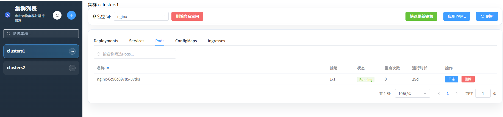
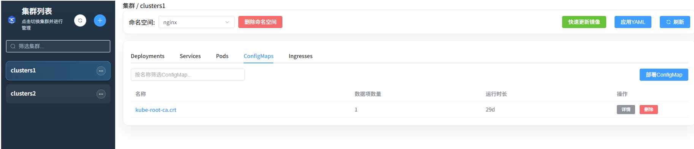

# KubeYun

KubeYun 一个简洁的 Kubernetes 集群管理平台， 支持 kubeconfig 和 ssh 两种方式操控集群。

## 功能特性

- ✅ 集群管理
- ✅ Namespace 管理
- ✅ Deployment 管理
- ✅ Service 管理
- ✅ Pod 管理
- ✅ ConfigMap 管理
- ✅ Ingress 管理




## 计划事项

- 📋 用户及权限管理
- 📋 Secret 管理
- 📋 StatefulSet 管理
- 📋 CronJob 管理

## 使用说明

### 使用 Docker Compose (推荐)
```bash
# 构建并启动服务
docker-compose up -d

# 访问应用
# 前端: http://localhost
# 后端API: http://localhost/api
```

### 本地运行

#### 1. 安装后端依赖

```bash
pip install -r requirements.txt
```

#### 2. 安装前端依赖

```bash
cd app
npm install
```

#### 3. 开发模式运行

终端1 - 启动后端：
```bash
python run.py
```

终端2 - 启动前端开发服务器：
```bash
cd app
npm run dev
```

访问：http://localhost:3000

## 注意事项

- 配置文件 `.clusters.yaml` 和加密密钥 `.crypto.key` 会保存在项目根目录
- SSH 密码会被加密存储
- 确保有相应的 K8s 集群访问权限

## 项目结构

```
k8s-manage/
├── api/                    # 后端代码
│   ├── app.py             # Flask 应用主文件
│   ├── crypto_utils.py    # 加密工具
│   ├── k8s_client_svc.py  # K8s 客户端服务
│   └── ssh_client.py      # SSH 客户端
├── app/                    # 前端代码
│   ├── src/
│   │   ├── components/    # Vue 组件
│   │   ├── views/         # 页面视图
│   │   ├── api/           # API 接口
│   │   ├── router/        # 路由配置
│   │   ├── store/         # Vuex 状态管理
│   │   ├── App.vue        # 根组件
│   │   └── main.js        # 入口文件
│   ├── package.json       # 前端依赖
│   └── vite.config.js     # Vite 配置
├── run.py                  # 启动文件
└── requirements.txt       # Python 依赖
```


## 许可证

本项目采用 Apache License 2.0 许可证，详情请参见 [LICENSE](./LICENSE) 文件。

